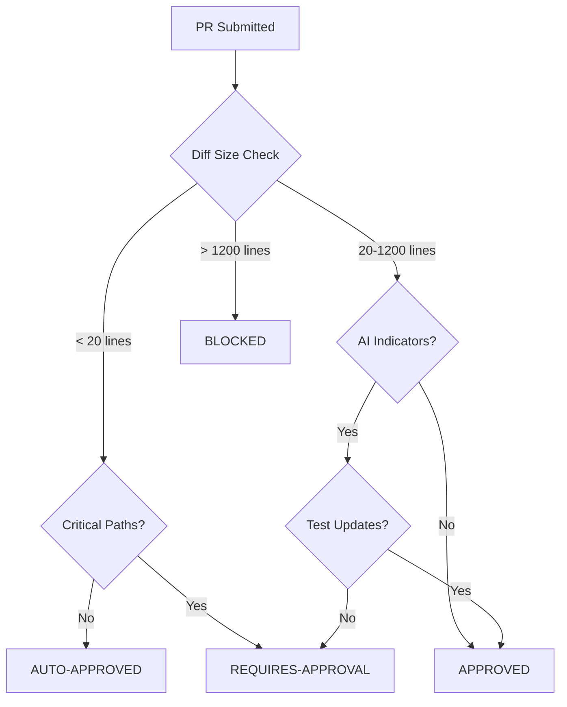

# TEQUMSA AI Governance Procedures

## Overview

This document provides detailed operational procedures for implementing AI governance within the TEQUMSA repository ecosystem. It complements the high-level policy framework defined in `AI_POLICY.md` with specific workflows, decision trees, and implementation guidance.

## Governance Architecture

### Governance Layers

```
┌─────────────────────────────────────────┐
│              Policy Layer               │
│     (AI_POLICY.md - Strategic)         │
├─────────────────────────────────────────┤
│            Procedure Layer              │
│    (This Document - Operational)       │
├─────────────────────────────────────────┤
│           Implementation Layer          │
│   (.claude.yml + GitHub Workflows)     │
├─────────────────────────────────────────┤
│             Execution Layer             │
│        (Scripts + Automation)           │
└─────────────────────────────────────────┘
```

### Decision Authority Matrix

| Decision Type | Authority Level | Approval Required | Override Conditions |
|---------------|----------------|-------------------|-------------------|
| Configuration Changes | Maintainer | 1 Reviewer | Emergency + Post-review |
| Policy Updates | Organization | Majority Consensus | Critical Security |
| AI Assistant Addition | Organization | Unanimous | N/A |
| Emergency Suspension | Any Maintainer | None | Immediate Review |

## AI Review Gate Procedures

### Gate Evaluation Process

#### Step 1: Automated Analysis
1. **Diff Size Assessment**
   - Calculate total line changes
   - Apply size-based routing rules
   - Log metrics for governance tracking

2. **Path Sensitivity Analysis**
   - Identify critical path modifications
   - Assess security impact potential
   - Determine review escalation needs

3. **AI Pattern Detection**
   - Analyze commit messages for AI indicators
   - Check author patterns (claude-bot, etc.)
   - Evaluate refactoring signatures

#### Step 2: Gate Decision


#### Step 3: Response Actions
- **AUTO-APPROVED**: Proceed with standard review process
- **APPROVED**: Add approval label, allow AI assistance
- **REQUIRES-APPROVAL**: Request human reviewer, block AI assistance
- **BLOCKED**: Provide guidance for breaking into smaller PRs

### Override Procedures

#### Emergency Override
**Trigger Conditions**:
- Critical security patch required
- Production system failure
- Data loss prevention

**Procedure**:
1. Maintainer sets `EMERGENCY_OVERRIDE=true` in PR description
2. AI gate bypassed with immediate logging
3. Emergency review process initiated within 4 hours
4. Post-incident governance review mandatory

#### Planned Override
**Use Cases**:
- Large feature merges from stable branches
- Generated documentation updates
- Bulk dependency updates

**Procedure**:
1. Pre-approval requested via governance issue
2. Scope and rationale documented
3. Time-bound approval granted
4. Enhanced monitoring during override period

## Auto-Labeling Governance

### Label Categories and Rules

#### Component Labels
- **component:backend** → Python files, backend/ directory
- **component:frontend** → JS/HTML/CSS files, frontend/ directory
- **component:ai** → Claude/AI-related files
- **component:security** → Security-sensitive paths
- **component:workflows** → GitHub Actions modifications
- **component:documentation** → Markdown files, docs/

#### Size Labels
- **size:small** → ≤ 20 lines changed
- **size:medium** → 21-100 lines changed
- **size:large** → 101-500 lines changed
- **size:xlarge** → > 500 lines changed

#### Status Labels
- **status:ready-for-review** → All readiness criteria met
- **status:needs-work** → Missing requirements identified
- **needs-tests** → Backend changes without test updates
- **needs-documentation** → Large changes without docs
- **security-review** → Security-sensitive modifications

### Readiness Assessment Algorithm

```python
def assess_pr_readiness(pr_data):
    issues = []
    
    # Test coverage requirement
    if has_backend_changes(pr_data) and not has_test_changes(pr_data):
        issues.append("needs-tests")
    
    # Documentation requirement
    if large_changes(pr_data) and not has_doc_changes(pr_data):
        issues.append("needs-documentation")
    
    # Description requirement
    if significant_changes(pr_data) and insufficient_description(pr_data):
        issues.append("needs-description")
    
    # Security flagging
    if has_security_changes(pr_data):
        issues.append("security-review")
    
    return "ready-for-review" if not issues else "needs-work"
```

## Refactor Test Guard Implementation

### Detection Algorithms

#### AI Refactor Identification
1. **Author Pattern Matching**
   ```regex
   /(claude-bot|ai-assistant|copilot|automated)/i
   ```

2. **Commit Message Analysis**
   ```regex
   /(ai-refactor|claude.*refactor|automated.*refactor|ai.*cleanup)/i
   ```

3. **Change Pattern Analysis**
   - High deletion-to-addition ratio (> 0.8)
   - Multiple code files affected (≥ 3)
   - Consistent formatting changes across files

#### Test Coverage Verification
1. **Direct Test File Changes**
   - Modified files matching test patterns
   - New test files added
   - Test coverage reports updated

2. **Indirect Test Updates**
   - Related test files in same module
   - Integration test modifications
   - End-to-end test adjustments

### Guard Response Procedures

#### Guard Failed
1. **Immediate Actions**
   - Block PR merge capability
   - Add `refactor-guard:failed` label
   - Post explanatory comment with guidance

2. **Required Remediation**
   - Add/update tests for refactored code
   - Verify test coverage metrics
   - Document rationale for any test exemptions

3. **Approval Process**
   - Technical reviewer approval required
   - Test coverage verification
   - Policy compliance confirmation

#### Guard Passed
1. **Documentation**
   - Add `refactor-guard:passed` label
   - Log successful compliance event
   - Update metrics for governance tracking

2. **Enhanced Review**
   - Priority queue for human review
   - Focus on AI-generated change quality
   - Verify architectural alignment

## Summary Generation Procedures

### Trigger Conditions

#### Automatic Triggers
- PR labeled with `ai-summary-requested`
- PR exceeds 50 lines of changes
- Complex multi-component changes detected

#### Manual Triggers
- Comment: `/claude summarize`
- Comment: `/ai-summary`
- Maintainer request via workflow dispatch

### Summary Generation Process

#### Content Analysis
1. **File Categorization**
   - Backend, frontend, configuration, tests, docs
   - Impact assessment for each category
   - Dependency relationship mapping

2. **Change Complexity Assessment**
   - Size categorization (small/medium/large/xlarge)
   - Change type analysis (feature/refactor/fix)
   - Risk level evaluation

3. **Context Integration**
   - PR description analysis
   - Related issue connections
   - Historical change patterns

#### Summary Structure
```markdown
# 📊 AI-Generated PR Summary

## Overview
- Title: [PR Title]
- Author: [Author]
- Total Changes: [X] lines

## Component Analysis
### [Component Category]
- [File list]
- [Impact description]

## Impact Assessment
- Code Quality: [Assessment]
- Complexity: [Level]
- Areas of Concern: [List]

## Recommendations
- [Actionable items]
```

## Metrics and Compliance Monitoring

### Key Performance Indicators

#### Governance Effectiveness
- **Policy Compliance Rate**: % of PRs meeting governance requirements
- **AI Adoption Rate**: % of PRs using AI assistance
- **Guard Success Rate**: % of refactor guards passed
- **Review Accuracy**: Human reviewer agreement with AI assessments

#### Operational Efficiency
- **Processing Time**: Average time for AI analysis
- **False Positive Rate**: Incorrect gate decisions
- **Override Frequency**: Emergency/planned override usage
- **User Satisfaction**: Developer experience feedback

### Monitoring Procedures

#### Real-Time Monitoring
1. **Dashboard Updates**
   - Live metrics display
   - Alert thresholds configured
   - Anomaly detection active

2. **Automated Alerts**
   - Policy violations flagged immediately
   - Performance degradation notifications
   - Security incident triggers

#### Periodic Reviews

##### Weekly Reviews
- Metrics aggregation and analysis
- Trend identification and assessment
- Policy adjustment recommendations
- Stakeholder communication

##### Monthly Assessments
- Deep-dive analysis of governance effectiveness
- User feedback compilation and analysis
- Policy refinement proposals
- Strategic alignment verification

##### Quarterly Audits
- Comprehensive governance review
- External audit preparation
- Long-term trend analysis
- Strategic planning updates

## Incident Response Procedures

### Incident Classification

#### Severity Levels
- **Critical**: Security breach, data loss, system compromise
- **High**: Policy violation, significant disruption, compliance failure
- **Medium**: Performance degradation, minor policy deviation
- **Low**: Cosmetic issues, documentation gaps

#### Response Teams
- **Critical**: Organization leadership + external experts
- **High**: Repository maintainers + security team
- **Medium**: Primary maintainer + affected stakeholders
- **Low**: Assigned maintainer + routine follow-up

### Response Procedures

#### Immediate Response (0-1 hour)
1. **Containment**
   - Suspend AI operations if necessary
   - Isolate affected systems
   - Preserve evidence and logs

2. **Assessment**
   - Determine scope and impact
   - Classify severity level
   - Activate appropriate response team

3. **Communication**
   - Notify stakeholders
   - Document initial findings
   - Establish communication channels

#### Investigation Phase (1-24 hours)
1. **Root Cause Analysis**
   - Technical investigation
   - Policy compliance review
   - Timeline reconstruction

2. **Impact Assessment**
   - Affected systems identification
   - Data integrity verification
   - Security posture evaluation

#### Resolution Phase (24-72 hours)
1. **Remediation**
   - Technical fixes implementation
   - Policy updates if required
   - Process improvements

2. **Testing**
   - Solution verification
   - Regression testing
   - Security validation

#### Recovery Phase (72+ hours)
1. **Service Restoration**
   - Gradual service reinstatement
   - Monitoring intensification
   - Performance verification

2. **Documentation**
   - Incident report completion
   - Lessons learned documentation
   - Policy update recommendations

## Training and Onboarding

### New Contributor Onboarding

#### Required Knowledge
1. **TEQUMSA Principles**
   - Ethical framework understanding
   - Lattice awareness concepts
   - Sovereignty principles

2. **AI Governance Framework**
   - Policy overview and key principles
   - Workflow integration points
   - Compliance requirements

3. **Tool Proficiency**
   - GitHub Actions workflows
   - AI assistant interaction
   - Governance script usage

#### Onboarding Process
1. **Documentation Review**
   - AI_POLICY.md study
   - This procedures document
   - Hands-on workflow testing

2. **Practical Training**
   - Shadow experienced contributors
   - Guided AI assistance usage
   - Governance tool familiarization

3. **Certification**
   - Knowledge assessment
   - Practical demonstration
   - Ongoing mentorship assignment

### Ongoing Training

#### Monthly Sessions
- Policy updates and changes
- Best practice sharing
- Tool improvements and features
- Case study analysis

#### Quarterly Workshops
- Advanced governance techniques
- Cross-functional collaboration
- External expert presentations
- Strategic planning participation

## Configuration Management

### .claude.yml Management

#### Update Procedures
1. **Proposed Changes**
   - Issue creation with rationale
   - Impact assessment documentation
   - Stakeholder review request

2. **Review Process**
   - Technical feasibility evaluation
   - Policy compliance verification
   - Security impact assessment

3. **Implementation**
   - Staged rollout with monitoring
   - Performance impact tracking
   - Rollback capability maintenance

#### Version Control
- All changes tracked in git
- Configuration history maintained
- Rollback procedures documented
- Emergency override capabilities

### Workflow Maintenance

#### Regular Updates
- Dependency security patches
- Performance optimizations
- Feature enhancements
- Bug fixes and improvements

#### Emergency Changes
- Critical security updates
- Service restoration fixes
- Compliance requirement changes
- Performance emergency responses

---

## Quick Reference

### Emergency Contacts
- **Policy Questions**: Repository maintainers
- **Security Incidents**: Security team + organization leadership  
- **Technical Issues**: Primary maintainer
- **Compliance Concerns**: Governance board

### Key Commands
- **Suspend AI**: Set AI_BOT_DISABLED secret to 'true'
- **Manual Summary**: Comment `/claude summarize`
- **Emergency Override**: Add `EMERGENCY_OVERRIDE=true` to PR description
- **Governance Review**: Create issue with `governance` label

### Important Files
- `AI_POLICY.md`: High-level governance policy
- `.claude.yml`: AI configuration settings
- `.ai-metrics/`: Governance metrics and logs
- `CONTRIBUTING_AI_APPENDIX.md`: Contributor guidance

---

*This document serves as the operational implementation guide for TEQUMSA AI governance and should be consulted for all governance-related procedures and decisions.*

**Version**: 1.0  
**Last Updated**: Implementation Date  
**Next Review**: 30 days post-implementation  
**Maintainer**: TEQUMSA Repository Governance Team