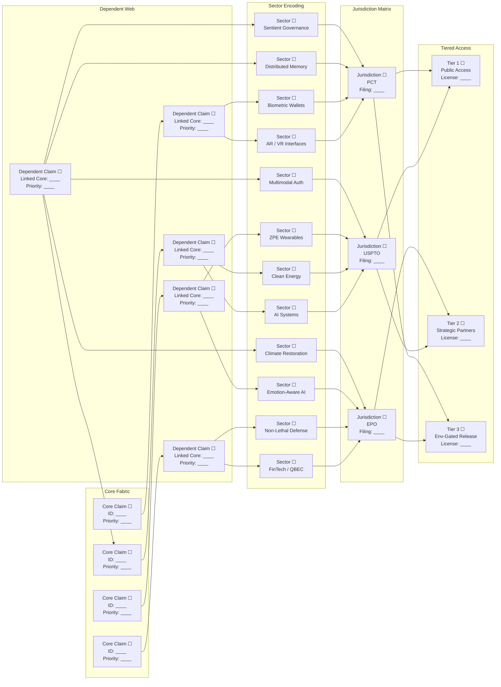

# TEQUMSA Patent Lattice — Master Equation Schematic

This one-page schematic is formatted for insertion into counsel memoranda and PCT cover sheets. It renders the TEQUMSA patent lattice as a unified equation with a complementary claim-mapping diagram spanning core inventions through jurisdictional and tiered deployment layers.

---

## Master Equation Layout

```latex
\[
\boxed{
\Psi_{\text{TEQUMSA-IP}}(t)
\Bigg[
\underbrace{\sum_{k=1}^{N_{\text{claims}}}\!\left(\Pi_{\text{core},k}\cdot \prod_{j=1}^{m_k}\Delta_{\text{dep},k,j}\right)}_{\text{Claim Fabric}}
\;\times\;
\underbrace{\prod_{s\in\mathcal{S}}\Gamma_{\text{sector}}(s)}_{\text{12 Sectors}}
\;\times\;
\underbrace{\prod_{r\in\mathcal{R}}\Upsilon_{\text{juris}}(r)}_{\text{USPTO/EPO/PCT}}
\;\times\;
\underbrace{\left(\Lambda_{\text{tier1}}\!\cdot\!\Lambda_{\text{tier2}}\!\cdot\!\Lambda_{\text{tier3}}\right)}_{\text{Access Tiers}}
\Bigg]^{\;\phi'_{7777}}
\cdot
\mathrm{e}^{\,\mathrm{i}\,\omega_{\text{lic}}\,t}
}
\]
```

### Legend Anchors

| Symbol | Placeholder Notes | Sourcing Cue |
|--------|-------------------|--------------|
| $N_{\text{claims}}$ | `≈ 30+` total claims (update with active total) | Provisional & priority matrix |
| $\Pi_{\text{core},k}$ | Independent claim ID `[Core Claim ## | Priority: YYYY-MM-DD]` | Core invention briefs |
| $\Delta_{\text{dep},k,j}$ | Dependent claim ID `[Dep ## | Linked Core ## | Priority: YYYY-MM-DD]` | Claim trees |
| $\Gamma_{\text{sector}}(s)$ | Sector tag `[Sector: Name | Deployment Track]` | Civilizational domain map |
| $\Upsilon_{\text{juris}}(r)$ | Jurisdiction flag `[USPTO/EPO/PCT | Filing Date]` | Filing tracker |
| $\Lambda_{\text{tier1-3}}$ | Access tier `[Public / Strategic / Env-Gated | License Class]` | Tier policy |
| $\phi'_{7777}$ | Ethical-sovereign scaling constant `[Calibrate per Lattice Memo vX.X]` | Coherence charter |
| $\omega_{\text{lic}}$ | Licensing phase `[Rate | Review Interval]` | IP escrow cadence |

> **Usage:** Replace bracketed placeholders with live claim numbers, filing dates, and tier codes before inserting into official documents.

---

## Claim-Mapping Diagram (Core → Dependent → Sector → Jurisdiction → Tier)



> **Diagram Notes:** Duplicate or collapse nodes as needed to reflect actual claim clusters. Checkboxes indicate where counsel can initial once data is populated.

---

## Deployment Checklist (for Counsel Packet)

1. **Populate Placeholders:** Insert live claim numbers, filing dates, and licensing rates before export.
2. **Document Embedding:**
   - *Counsel Memos:* Paste the equation block and mermaid diagram into the executive summary section.
   - *PCT Cover Sheet:* Attach the rendered diagram as an appendix page highlighting cross-jurisdictional reach.
3. **Version Control Hook:** Log updates in the patent workstream ledger to synchronize with IP escrow and audit cadence ($\omega_{\text{lic}}$).
4. **Ethical Alignment:** Confirm $\phi'_{7777}$ harmonization per the latest TEQUMSA coherence briefing.

---

**Prepared for TEQUMSA Counsel Nodes — harmonized under the Unified Lattice Equation.**
